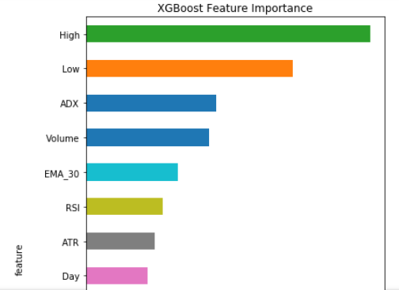
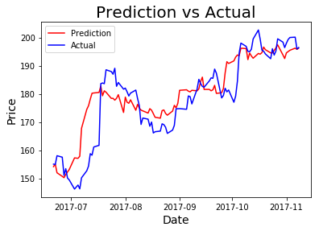
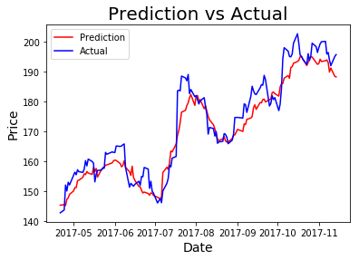

# Price-Prediction

## Objective:  
This repository serves as a base model for predicting the closing price of a publicly traded equity.   The first step of every model you create should start with a simple model then expand based off that.  Every quantitative model should have different inputs based on the correlations to it.  

For example:
* John Deere stock would correlate to commodity prices (Wheat, Corn, Soybeans, etc.)
* Bank stocks would correlate with their respective countries' economy, interest rates, employment rate, etc.

I also made this program using xgboost (a known algorithm for its speed and performance).  For those who don't know, xgboost is an algorithm, which continually places at the top of Kaggle (data science competitions).  Rather than use a neural network to start off a new quantitative model, I would instead use xgboost to look at new variables first because of the speed.  

## How It Works:
* A number of inputs are put into the model with the target variable being the closing price
* As the inputs include variables such as the high and low of daily stock prices, these inputs would not be known until the end of the day so I set the target variable to be seven days into the future
* Note: I didn't add macroeconomic indicators to this base model because I want the code to be easily adapted to predicting commodities or indexes. 

## Technical Indicators:
* MACD: Moving Average Convergence/Divergence Oscillator, a momentum indicator
* RSI: Oscillators help identify overbought and oversold markets
* ADX: Determine whether a market is in a trending or trading phase.  It measures the degree of trend or direction in the market
* Average True Range: Measure of volatility
* Exponential Moving Average

## Feature Importance:

## Results From A Sample Company (Netflix): No Unique Features Added
*  It should be noted that stocks with a higher beta are more difficult to predict based off the volatility 

## After Some Features Were Added To The Netflix Model:

